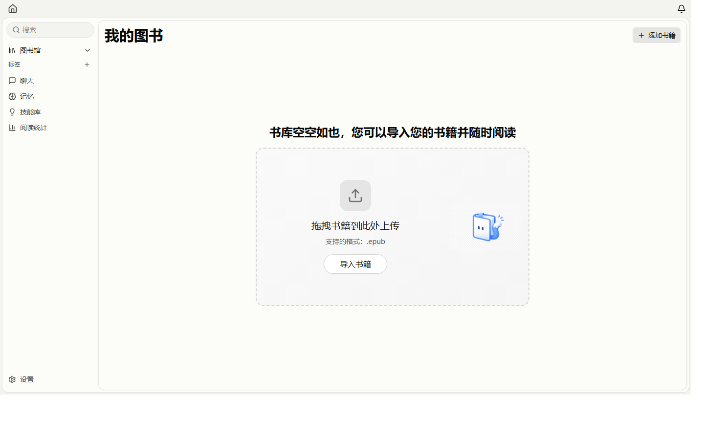

<div align="center">

# DeepReader

**面向持续理解、主动批注与本地知识沉淀的 AI 桌面阅读器**

[](LICENSE)
[](package.json)
[](#安装与运行)

</div>

DeepReader 将电子书阅读、AI 对话、自动共读、人工笔记、AI 书评、阅读记忆与统计分析整合在同一个本地优先的桌面应用中。项目关注的不是一次性的内容问答，而是让 AI 在不超过读者进度的前提下持续理解上下文、保留阅读脉络，并把真正值得停留的内容沉淀为可定位、可回看的书内批注。

> DeepReader 基于 [SageRead](https://github.com/xincmm/sageread) 与 [Foliate JS](https://github.com/johnfactotum/foliate-js) 相关技术继续演进。感谢原项目及其贡献者提供的基础能力。

## 界面预览



## 核心能力

### 阅读与图书管理

- 图书馆管理、目录导航、全文搜索、阅读进度保存与书内定位。
- 高亮、摘录、标签、人工笔记和书内批注。
- 阅读时长、活跃日期与阶段性阅读统计。

### AI 对话与知识工具

- 围绕当前书籍、阅读位置和会话上下文持续追问。
- 支持 OpenAI、Anthropic、Google、DeepSeek、OpenRouter 及 OpenAI-compatible 服务。
- 可选向量索引与全书检索，用于超出当前页面范围的检索增强问答。
- 支持长期阅读记忆、Slash 命令、技能扩展和 Obsidian 导出。

### Agent 自动共读

普通自动共读遵循“与读者保持同一进度”的约束：

1. 只采样读者**当前完整可见页或双页**；
2. 一个完整可见焦点只发起一次模型请求，不按 DOM 段落逐条请求；
3. Agent 在一次响应中自主决定留下 `0–3` 条最终书评；
4. 每条书评必须引用当前可见焦点中的逐字原文，并可从批注返回对应位置；
5. 历史待处理记录可以保留，但不会抢占当前阅读位置；
6. 翻页、切书、隐藏或关闭阅读器会取消旧焦点请求，旧页不得在失去焦点后写入书评或覆盖连续摘要。

一个页面焦点可能包含多个正文段，因此界面会分别显示“页面焦点数”和“正文段数”。正文段数不是模型请求次数。

### 范围阅读与共读记录

- 可按 EPUB 章节范围或 PDF 页码范围创建独立阅读任务。
- 支持暂停、续跑、停止、失败恢复和阅读足迹。
- 普通跟读与范围阅读在提交边界互斥，避免两条任务链同时修改同一阅读状态。
- 可将已有 AI 共读记录整理为独立共读日记；日记写入与普通自动共读决策相互隔离。

## 支持的书籍格式

当前公开图书导入入口支持：

| 格式 | 状态     | 说明                                                     |
| ---- | -------- | -------------------------------------------------------- |
| EPUB | 正式支持 | 阅读、目录、定位、批注、普通共读与章节范围阅读的主要格式 |

底层文档适配层包含 MOBI、CBZ、FB2、FBZ 等解析代码，类型与范围任务模型中也预留了 PDF 能力，但这些格式尚未全部接入当前公开导入入口，文本定位、全文索引和 AI 共读能力也不完整，因此不列为正式支持。当前范围阅读以 EPUB 章节为稳定入口；相关能力扩展应以实际导入 UI 和回归测试为准。

## 安装与运行

### 普通用户

请从本仓库的 [Releases](https://github.com/1902435792/nova-reading/releases) 页面下载适合系统的安装包。

- **Windows**：使用 NSIS `.exe` 安装包。Windows 10 若无法启动，请确认已安装 [Microsoft Edge WebView2 Runtime](https://developer.microsoft.com/microsoft-edge/webview2/)。
- **macOS**：根据处理器架构选择对应构建；未签名或 ad-hoc 签名构建可能需要在系统安全设置中手动允许。

当前版本不提供应用内自动更新。升级时请重新下载安装包；覆盖安装前建议备份重要数据。

### 首次配置

阅读和本地图书管理不要求模型服务。使用 AI 对话、自动共读、AI 书评或记忆能力前，请在设置中配置：

- Provider 类型；
- Base URL；
- API Key；
- 模型名称。

如需全书语义检索，可另外配置 embedding 模型。联网搜索、语音和 Obsidian 集成均为可选能力。

## 可选：VCP Bridge 集成

DeepReader 可以通过 OpenAI-compatible Provider 接入 VCP Bridge。推荐为自动共读使用独立 Profile，并使请求继续满足以下应用侧协议：

```json
{
  "summary": "连续、不过度剧透的阅读摘要",
  "annotations": []
}
```

集成时应注意：

- Profile 可以保留人格、时间线、只读日记召回和记忆上下文；
- 普通自动共读决策轮只返回严格 JSON，不应输出工具协议或写日记；
- 批注只能落在 `CURRENT_VISIBLE_FOCUS`，历史上下文只能辅助理解；
- VCP Bridge 是可选外部组件，不随 DeepReader 安装包一同分发；
- 不要把 API Key、访问令牌、私人日记或 Provider 配置提交到仓库。

## 从源码开发

### 环境要求

- Node.js 20 或更高版本；
- pnpm 9 或更高版本；
- Rust stable toolchain；
- Tauri 2 所需系统依赖；
- Windows 构建需要 Visual Studio C++ Build Tools 与 WebView2；
- macOS 构建需要 Xcode Command Line Tools。

### 安装依赖

```bash
pnpm install
```

### 启动桌面开发环境

```bash
pnpm dev
```

该命令从仓库根目录启动 Vite 前端与 Tauri 桌面窗口。

### 前端类型检查与生产构建

```bash
cd packages/app
pnpm exec tsc --noEmit
pnpm build
```

### 共读测试

PowerShell：

```powershell
cd packages/app
$tests = Get-ChildItem src -Recurse -File -Filter '*co-reading*.test.ts' |
  ForEach-Object { $_.FullName }
node --import tsx --test $tests
```

### Rust 检查与测试

```bash
cd packages/app/src-tauri
cargo fmt --all -- --check
cargo check
cargo test --lib
```

### 构建 Windows NSIS 安装包

在仓库根目录运行：

```bash
pnpm --filter app tauri build --bundles nsis
```

默认产物位于：

```text
packages/app/src-tauri/target/release/bundle/nsis/
```

构建全部桌面目标也可以使用：

```bash
pnpm build
```

## 项目结构

```text
packages/
  app/
    src/                         React、阅读器 UI、AI 服务与状态管理
    src-tauri/                   Rust 后端、SQLite、Tauri commands 与打包配置
  foliate-js/                    电子书渲染与可见页面定位
  app-tabs/                      桌面标签页工作区组件
```

自动共读的主要实现位置：

```text
packages/app/src/pages/reader/hooks/use-co-reading.ts
packages/app/src/services/co-reading-ai-service.ts
packages/app/src/lib/co-reading-*.ts
packages/app/src-tauri/src/core/co_reading/
```

## 数据与隐私

- 图书、笔记、共读队列、阅读足迹和设置默认保存在本机应用数据目录。
- AI 请求会发送到用户自行配置的 Provider；其数据处理方式取决于对应服务商。
- DeepReader 不提供公共模型账户，也不会替用户承担第三方模型费用。
- 自动共读会发送当前可见正文、有限的近期阅读上下文、连续摘要和近期 AI 批注；应用通过预算限制控制上下文规模。
- 删除应用或覆盖安装前，请先备份重要图书、数据库、Provider 设置和导出内容。
- 提交 Issue 或日志时，请移除 API Key、Authorization Header、书籍正文、私人笔记、日记、记忆内容和本机用户名路径。

## 当前状态与限制

- 项目仍在持续开发，数据库、共读协议和实验性格式支持可能继续演进。
- 自动共读要求模型稳定返回严格结构化 JSON；额度、认证、网络、限流与格式错误会分别显示。
- 历史失败记录不会自动伪装成当前请求；需要时可以在面板中显式重试。
- 当前没有应用内自动更新。
- 大型前端 chunk 和部分既有 Rust 未使用代码仍会产生非阻断构建警告。

## 贡献

欢迎通过 Issue 或 Pull Request 提交改进。开始前请阅读 [CONTRIBUTING.md](CONTRIBUTING.md)。

提交前至少确认：

1. TypeScript 类型检查通过；
2. 相关 Node 测试通过；
3. 涉及 Rust 时 `cargo fmt --check`、`cargo check` 和 `cargo test --lib` 通过；
4. 没有提交密钥、个人数据、构建产物或本机运行记录；
5. 行为变化、数据库变化和验证方式已在 PR 中说明。

发布流程见 [docs/release-workflow.md](docs/release-workflow.md)。

## License

DeepReader 以 [GNU Affero General Public License v3.0](LICENSE) 发布。分发、修改或通过网络提供本项目服务时，请遵守许可证要求，并保留原项目与第三方组件的版权和许可证声明。
